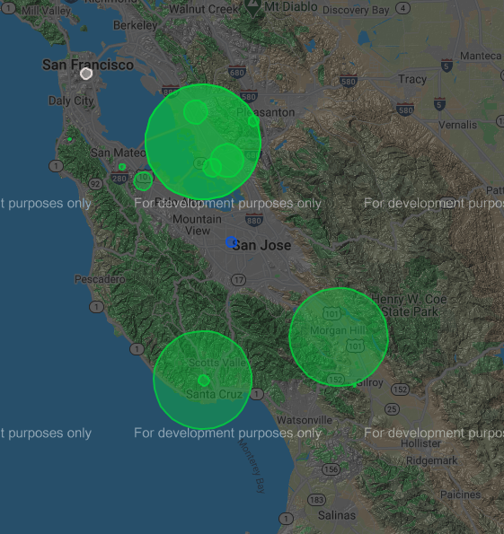

# MYCO_ON_GOOGLEMAPS
**Course:** Cmpe 280 Web UI
**Learning Objective:** Develop Dynamic Google Maps

After completing CMPE 280 class, you have earned Web UI Architect contract-to-hire opportunity at MyCo company. MyCo is a speacilizied retailer with 15 locations in Bay Area. Out of 15 locations, two are distribution facilities, one location is Headquarters, one is a call center, and other 11 locations are retail locations.

 Your project manager wanted represent company locations on Google Maps (as part of contacts page). For User conveinance, he wanted to use custom flags for each location type and number the retail locations.

Flag Legend:

Distribution facilities – Red Flag
Headquarters – White Flag
Call center – Blue Flag
Retail locations – Green Flag

Please develop Google Page driver for the above requirement. You can load provided JSON from local file or from Web Server. Please create a microservice based Web Service. 

Part B:

For 11 retail locations, please add revenue circle - that is, size the Circle location based on revenue of the retail location.

## Run Application
Application should listen on localhost:3000
```
npm start
```

Screenshot of Map




## Resources
[Microservices](https://nodesource.com/blog/microservices-in-nodejs)